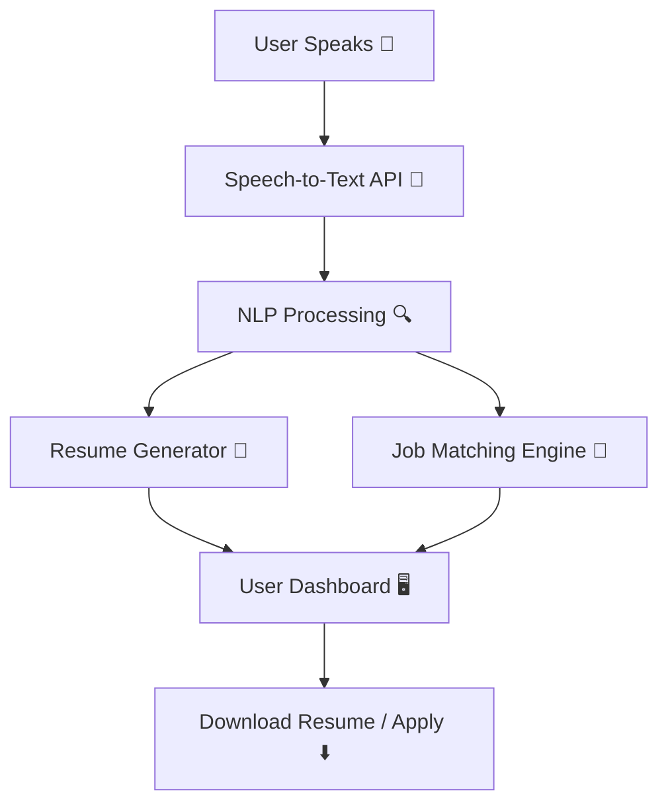

# JobSpeak AI
JobSpeak AI is an AI-powered employment assistant that helps job-seekers build professional resumes just by speaking about their skills and experience. It also suggests personalized job opportunities based on the user’s skills and location. Breaking barriers for freshers, non-technical workers, and anyone who struggles with resume creation.

# 💼 JobSpeak AI  
**AI Assistant for Job Seekers without Resumes**  
HackStreet Boy’s – GenAI Exchange Hackathon  

---

## 🚀 Overview  
**JobSpeak AI** is an **AI-powered employment assistant** that helps job-seekers build professional resumes **just by speaking about their skills and experience**.  
It also suggests **personalized job opportunities** based on the user’s skills and location.  

👉 Breaking barriers for freshers, non-technical workers, and anyone who struggles with resume creation.  

---

## ✨ Key Features  
- 🎤 **Voice-to-Resume** – Speak your skills, AI converts them into a professional CV.  
- 📄 **Instant Resume Generation** – Download resumes in PDF/Word with clean templates.  
- 💼 **Job Recommendation Engine** – AI suggests relevant local job opportunities.  
- 🌍 **Multi-language Support** – Input in English or regional languages.  
- ⚡ **User Dashboard** – Resume preview + job listings in one place.  
- 🔔 *(Stretch Goal)* LinkedIn profile auto-generation & job alerts.  

---

## 🛠️ Tech Stack  
**Frontend:** React / Next.js, Tailwind CSS  
**Backend:** Node.js + Express  
**Database:** MongoDB / PostgreSQL  
**AI Services:**  
- OpenAI Whisper / Google Speech API (Speech-to-Text)  
- GPT-4/5 (Resume generation & text enhancement)  
- Job APIs (LinkedIn, Indeed, Naukri – or mock dataset for demo)  

---

## 🖼️ Architecture  


---

## 📂 Project Structure  
```
JobSpeak-AI/
│── README.md
│── docs/                # Diagrams & submission docs
│── frontend/            # React/Next.js UI
│── backend/             # Node.js + Express APIs
│── database/            # Mongo/Postgres setup
│── ai-models/           # (Optional) custom AI/NLP scripts
│── tests/               # Unit & integration tests
```

---

## ⚡ Getting Started  

### 1️⃣ Clone the repo
```bash
git clone https://github.com/<your-username>/JobSpeak-AI.git
cd JobSpeak-AI
```

### 2️⃣ Setup Backend  
```bash
cd backend
npm install
npm run dev
```

### 3️⃣ Setup Frontend  
```bash
cd frontend
npm install
npm run dev
```

### 4️⃣ Environment Variables  
Create a `.env` file in **backend/** with:  
```
MONGO_URI=your_mongodb_connection
OPENAI_API_KEY=your_openai_api_key
JOB_API_KEY=your_job_api_key
```

---

## 🎯 Demo Flow  
1. User **speaks**: *“I am a web developer skilled in React, Node.js, and MongoDB. I live in Bangalore.”*  
2. AI **transcribes & extracts** skills, location, and experience.  
3. AI **generates a resume** in professional PDF format.  
4. AI **suggests local jobs** → “Frontend Developer @ XYZ, Full-stack Intern @ ABC.”  
5. User **downloads resume & applies**.  

---

## 🏆 Team – HackStreet Boy’s  
👨‍💻 **Team Leader:** Puspal Das  
💡 **Project:** JobSpeak AI – GenAI Exchange Hackathon  

---

## 📜 License  
This project is licensed under the MIT License – feel free to use and improve!  

---

🔥 With JobSpeak AI, we’re making job applications **as easy as speaking a sentence!**  
